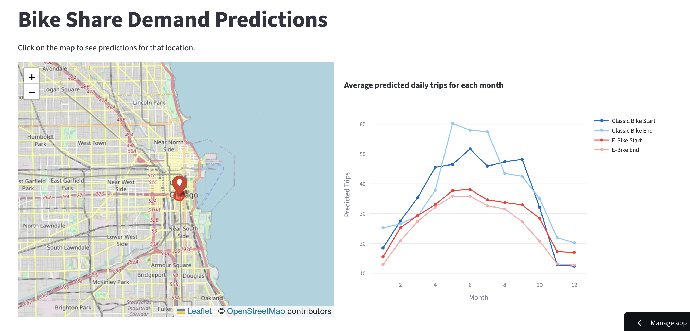

# Bike Demand Batch Inference

Streamlit app for visualizing bike share demand predictions for Chicago's Divvy bike share system.

> **Related Repository**: This app visualizes predictions generated by the models in the [Demand Prediction for Bike Share System Expansion](https://github.com/lishirley89/Demand-Prediction-for-Bike-Share-System-Expansion) repository, which contains the model training code, feature engineering, and model development pipeline.

## Live App

<div align="center">

[](https://bike-demand-batch-inference.streamlit.app/)

**[Click here to open the app](https://bike-demand-batch-inference.streamlit.app/)**

</div>




## Features

- Interactive map visualization of bike share demand predictions
- Click on any location to see monthly predictions for that H3 cell
- Displays predictions for:
  - Classic Bike Start/End
  - E-Bike Start/End
- Automatically fetches the latest predictions from S3
- Cached data access for optimal performance


## Project Structure

```
.
├── app/
│   ├── streamlit_app.py    # Main Streamlit application
│   └── data_access.py        # S3 data access module with caching
├── artifacts/              # Local artifacts (gitignored)
├── viz/                    # Visualization assets
│   └── demand-gif.gif      # Demo GIF
├── .streamlit/
│   └── secrets.toml        # AWS credentials (gitignored)
├── requirements.txt        # Python dependencies
└── README.md
```

## Related Projects

- **[Demand Prediction for Bike Share System Expansion](https://github.com/lishirley89/Demand-Prediction-for-Bike-Share-System-Expansion)**: The main repository containing:
  - Model training code (XGBoost models)
  - Feature engineering pipeline
  - Data processing scripts
  - Model evaluation and performance metrics
  - Batch inference pipeline that generates predictions stored in S3

This repository (bike-demand-batch-inference) is the visualization frontend that:
- Fetches pre-computed predictions from S3
- Provides an interactive web interface for exploring predictions
- Displays predictions on an interactive map


